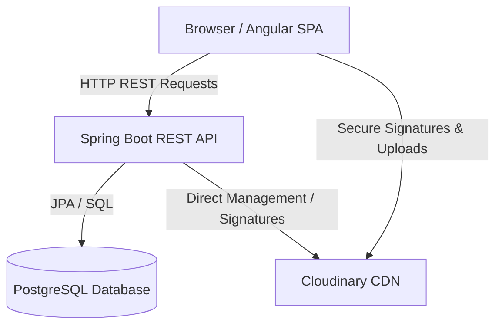
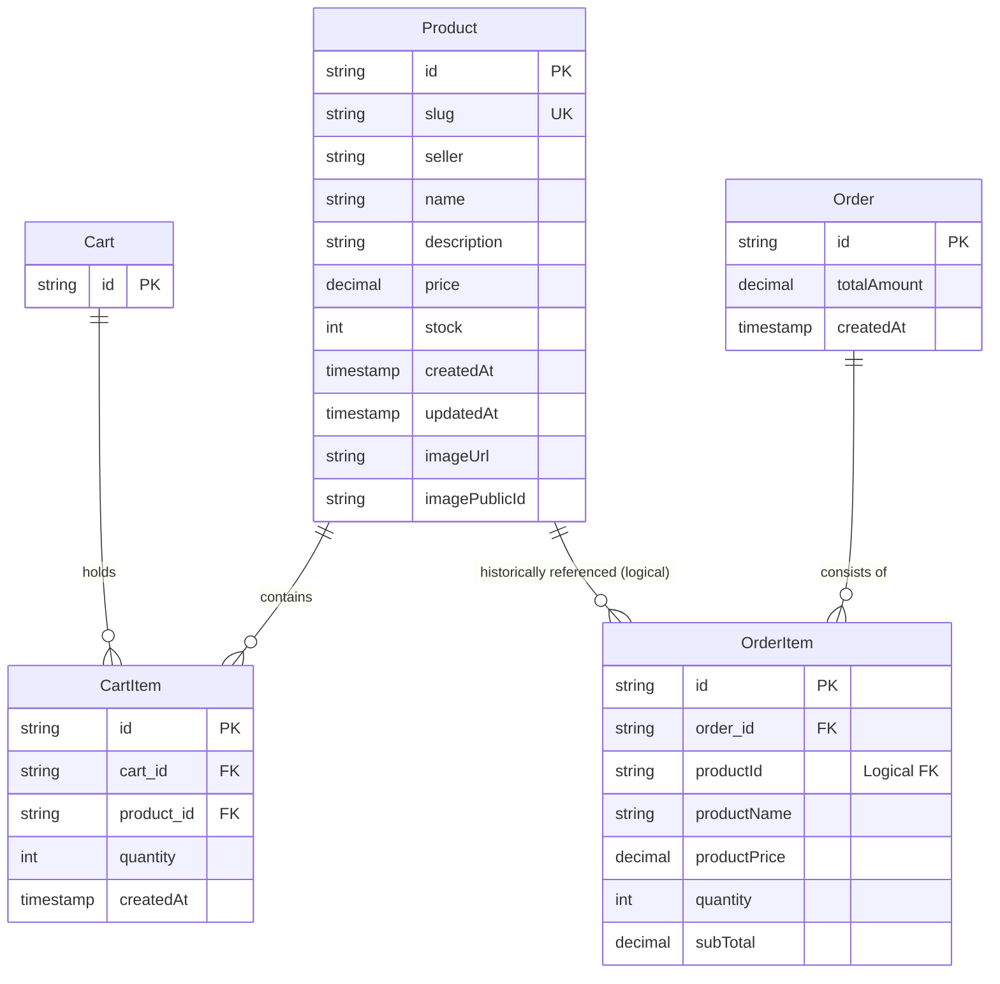
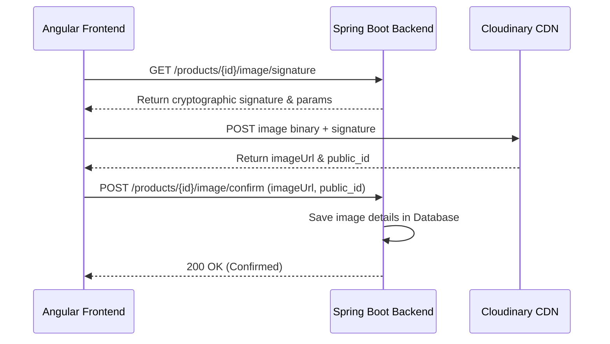

# System Architecture & Design Decisions

This document outlines the high-level architecture, design patterns, and crucial design decisions implemented in the **Spring E-Com** application (both Backend and Frontend).

---

## 1. High-Level Architecture Overview

Spring E-Com is split into two independent services:
- **Angular Single-Page Application (Frontend)**: Serves as the presentation layer, managing client-side routing, user interface, and state.
- **Spring Boot REST API (Backend)**: Powers business logic, data persistence, image uploads, stock validations, and order processing.



---

## 2. Key Backend Design Patterns & Decisions

### Entity Relationship Model (ERD)

The database schema is structured for transactional safety (ordering) and performance (shopping cart updates). Below is the Entity-Relationship Diagram:



* **Important Decoupling Pattern (Order History)**: Notice that `OrderItem` does **not** have a JPA foreign key relation (`@ManyToOne`) directly pointing to `Product`. Instead, it stores historical values (`productId`, `productName`, and `productPrice`) at the moment of checkout. This ensures that even if a product is modified or deleted in the future, past order records and receipts remain completely untainted.

### Secure Image Upload Pipeline
Instead of handling heavy file uploads directly on the JVM server (which consumes precious server bandwidth and memory), Spring E-Com uses a secure direct-to-cloud upload pattern:

1. **Signature Request**: The frontend requests a cryptographic signature from the backend controller (`ProductController`).
2. **Signature Verification**: The backend generates a secure signature using the Cloudinary API secret and returns it to the client.
3. **Direct Upload**: The frontend uploads the image binary directly to Cloudinary using the secure signature.
4. **Metadata Confirmation**: Once uploaded, the frontend confirms the image's public ID and URL to the backend, which saves them in the database.



### Safe Deletion Cascading
To prevent orphaned references and server-side errors, deleting a product:
- Automatically deletes the product's image asset in Cloudinary (using its `imagePublicId`).
- Cascades to remove that product from all active shopping carts (`CartItem` table), preventing cart retrieval failures for other active users.

### Coarse-Grained API Versioning (V2) & Database Pagination
To introduce pagination safely and demonstrate production-grade REST design, the application implements coarse-grained versioning:
* **API Version Separation**: Legacy `/api/v1` endpoints (for Products, Carts, and Checkout) are kept intact, renamed to `*V1.java` controllers, and annotated as `@Deprecated` to respect backward compatibility.
* **Unified `/api/v2` Namespace**: All endpoints are mapped to `/api/v2` for client consistency, allowing the frontend environment URL to switch entirely to V2.
* **Database-Level Paginated Sorting**: Rather than sorting the full product stream in-memory, the `ProductRepository` overrides `findAll(Pageable)` using a JPQL query that forces in-stock items to appear first (`ORDER BY CASE WHEN p.stock > 0 THEN 0 ELSE 1 END ASC`). This preserves the business rule while fetching paged queries with optimal DB indexes.
* **OpenAPI spec separation**: Defined distinct OpenAPI groups (`v1` and `v2`) in `OpenApiConfig` with `v2` loaded by default.

---

## 3. Key Frontend Design Patterns & Decisions

### Service-Facade Pattern
The Angular frontend organizes state and data retrieval using the Facade Pattern. Components never call HTTP services directly; they instead communicate with a Facade service (e.g., `CartFacade`, `ProductFacade`):

```
[Components]  ──>  [Facade Services (State & Signals)]  ──>  [API Services (HttpClient)]
```

* **Encapsulation**: Raw RxJS streams and HTTP details are completely hidden inside the Facade.
* **Angular Signals state**: State variables like `_items`, `_isLoading`, and `_error` are represented as Angular Signals, allowing the UI to react instantly and rendering to remain lightweight and performant.

### Fallback-Safe Error Handling
All API interactions run through centralized error handling routines. If a backend request fails, the facade handles the response safely:
```typescript
const backendMessage = err.error?.detail || err.error?.message;
this._error.set(backendMessage || `${errorMessage}. Please try again later`);
```
This safely supports the modern **RFC 7807 Problem Details** specification (`err.error.detail`) while falling back elegantly to legacy formats (`err.error.message`) or localized fallback messages if the backend is down.
