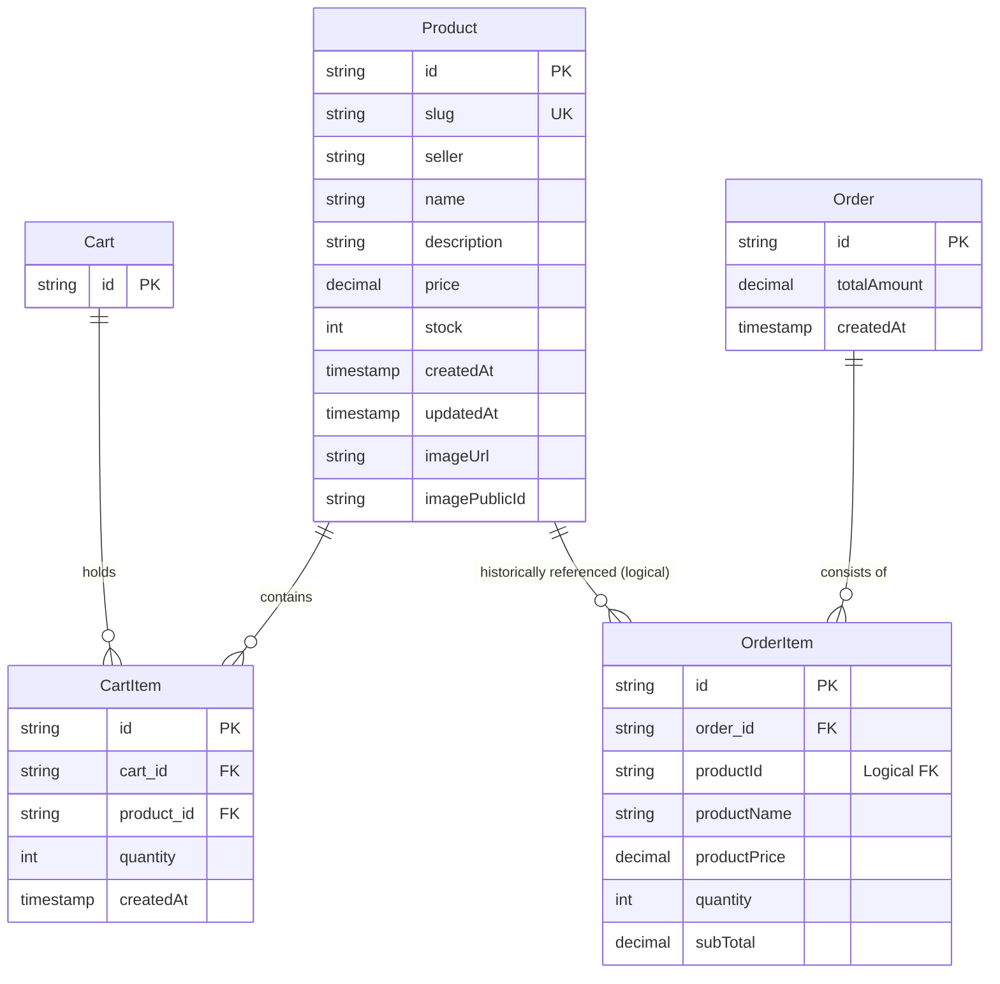

# Spring E-Com — Backend

REST API for a full-stack e-commerce application. It powers product catalog management, shopping cart operations, and checkout with stock validation. The Angular frontend consumes this API and is deployed separately.

## Live demo

| App | URL |
| --- | --- |
| Frontend | [https://spring-e-com.vercel.app](https://spring-e-com.vercel.app) |
| Backend API | [https://spring-e-com.duckdns.org](https://spring-e-com.duckdns.org) |

## Related repositories

| Repository | Description |
| --- | --- |
| [spring-e-com-back-end](https://github.com/Eyad-Sharkawy/spring-e-com-back-end) | This repo — Spring Boot REST API |
| [spring-e-com-front-end](https://github.com/Eyad-Sharkawy/spring-e-com-front-end) | Angular frontend (hosted on Vercel) |

## Tech stack

- **Java 21**
- **Spring Boot 4.1** — Web MVC, Data JPA, Validation
- **PostgreSQL** — persistent storage
- **Cloudinary** — cloud-based image storage and management
- **Lombok** — boilerplate reduction
- **Docker** — containerized builds
- **GitHub Actions** — automated deployment to an Oracle Cloud server

## Features

- **Products** — full CRUD with sorting, unique SEO URL slugs, two-level sorting (in-stock first, then out-of-stock), image uploads via Cloudinary, and safe deletion (automatically cascades to remove the deleted product from shopping carts)
- **Shopping cart** — add, update, and remove items (cart items include product image URLs); cart totals computed server-side
- **Checkout** — converts a cart into an order, reduces product stock, and clears the cart
- **Stock validation** — prevents adding to cart or checking out when stock is insufficient
- **CORS** — configurable allowed origins for the frontend
- **Global error handling** — consistent JSON error responses

## Database Schema (ERD)

The database relationships are represented in the following diagram:



For more architectural and system design details, check out the [System Architecture Document](ARCHITECTURE.md).

## API reference

Base path: `/api`

### Interactive Documentation & Testing

- **Swagger UI**: When the application is running, you can explore and interact with the API endpoints dynamically:
  - **Local Dev Server**: [http://localhost:8080/swagger-ui/index.html](http://localhost:8080/swagger-ui/index.html)
  - **Production API**: [https://spring-e-com.duckdns.org/swagger-ui/index.html](https://spring-e-com.duckdns.org/swagger-ui/index.html)
- **Postman Collection**: A pre-configured Postman Collection is supplied in [docs/spring_e_com_postman_collection.json](docs/spring_e_com_postman_collection.json). You can import this file directly into Postman to instantly test all catalog, cart, and checkout endpoints. It includes predefined environment variables (`baseUrl`, `cartId`, `productId`) for easy testing.

### Products

| Method | Endpoint | Description |
| --- | --- | --- |
| `GET` | `/products?sortBy=updatedAt&direction=desc` | List all products |
| `GET` | `/products/{identifier}` | Get a product by slug or UUID ID |
| `POST` | `/products` | Create a product |
| `PUT` | `/products/{id}` | Update a product |
| `DELETE` | `/products/{id}` | Delete a product |
| `POST` | `/products/{id}/image` | Upload/update product image (multipart/form-data) |

**Two-Level Sorting**

When listing products, the API automatically partitions the results:
1. **In-stock products** (`stock > 0`) are returned first, sorted by the specified `sortBy` and `direction` parameters.
2. **Out-of-stock products** (`stock == 0`) are returned next, also sorted by the specified parameters.

**Create / update body**

```json
{
  "seller": "Acme Store",
  "name": "Wireless Mouse",
  "description": "Ergonomic wireless mouse",
  "price": 29.99,
  "stock": 100
}
```

### Cart

| Method | Endpoint | Description |
| --- | --- | --- |
| `GET` | `/carts/{cartId}?sortBy=createdAt&direction=asc` | Get cart with items and total |
| `POST` | `/carts/{cartId}/items` | Add a product to the cart |
| `PUT` | `/carts/{cartId}/items/{productId}?quantity=2` | Update item quantity |
| `DELETE` | `/carts/{cartId}/items/{productId}` | Remove an item from the cart |

**Add item body**

```json
{
  "productId": "uuid-here",
  "quantity": 1
}
```

Cart item sort fields: `productName`, `productPrice`, `quantity`, `subTotal`, `createdAt`.

### Checkout

| Method | Endpoint | Description |
| --- | --- | --- |
| `POST` | `/checkout/{cartId}` | Place an order from the cart |

Returns an order with line items, total amount, and creation timestamp. The cart is cleared after a successful checkout.

### Error responses

The API implements the **RFC 7807 Problem Details** standard for all error responses (with a `Content-Type` of `application/problem+json`). 

Errors return a JSON object containing standard RFC 7807 properties along with custom properties for backward compatibility:

```json
{
  "type": "about:blank",
  "title": "Not Found",
  "status": 404,
  "detail": "Product not found with identifier: abc",
  "instance": "/api/products/abc",
  "message": "Product not found with identifier: abc",  // Backward compatible
  "timestamp": 1785146027823                              // Backward compatible
}
```

| Field | Type | Description |
| --- | --- | --- |
| `type` | String | A URI reference identifying the error type (defaults to `about:blank`) |
| `title` | String | A short, human-readable summary of the problem type |
| `status` | Integer | The HTTP status code |
| `detail` | String | A human-readable explanation specific to this occurrence of the problem |
| `instance` | String | A URI reference that identifies the specific occurrence of the problem |
| `message` | String | Backward-compatible alias for the `detail` property |
| `timestamp` | Long | Epoch timestamp of when the error occurred |

Common error codes:

| Status | When |
| --- | --- |
| `400` | Invalid request (e.g. empty cart, bad quantity, validation errors) |
| `404` | Resource (product or cart) or endpoint not found |
| `409` | Insufficient stock |

## Getting started

### Prerequisites

- Java 21
- Maven 3.9+ (or use the included `./mvnw` wrapper)
- PostgreSQL

### Environment variables

Copy the example file and fill in your values:

```bash
cp .env.example .env
```

On Windows (PowerShell):

```powershell
Copy-Item .env.example .env
```

The `.env` file is loaded automatically via `spring-dotenv`. See [`.env.example`](.env.example) for all required variables.

| Variable | Description | Default |
| --- | --- | --- |
| `DB_URL` | JDBC connection URL | — |
| `DB_USERNAME` | Database username | — |
| `DB_PASSWORD` | Database password | — |
| `DB_DRIVER` | JDBC driver class | — |
| `DB_DIALECT` | Hibernate dialect | — |
| `CLOUDINARY_CLOUD_NAME` | Cloudinary cloud name | — |
| `CLOUDINARY_API_KEY` | Cloudinary API key | — |
| `CLOUDINARY_API_SECRET` | Cloudinary API secret | — |
| `CORS_ALLOWED_ORIGINS` | Comma-separated allowed origins | `http://localhost:4200` |
| `PORT` | Server port | `8080` |

Schema is managed with `spring.jpa.hibernate.ddl-auto=update`, so tables are created and updated automatically on startup.

### Run locally

```bash
./mvnw spring-boot:run
```

On Windows:

```bash
mvnw.cmd spring-boot:run
```

The API will be available at `http://localhost:8080/api`.

### Run tests

```bash
./mvnw test
```

### Run with Docker

```bash
docker build -t spring-e-com .
docker run -p 8080:8080 --env-file .env spring-e-com
```

## Deployment

Pushes to the `main` branch trigger a GitHub Actions workflow (`.github/workflows/deploy.yml`) that:

1. SSHs into an Oracle Cloud server
2. Pulls the latest code
3. Builds the JAR with Maven
4. Restarts the `spring-e-com` systemd service

Required GitHub secrets: `SERVER_HOST`, `SERVER_USERNAME`, `SERVER_SSH_KEY`.

Production environment variables are configured on the server (not committed to the repo).

## Project structure

```
src/main/java/dev/eyadsharkawy/spring_e_com/
├── config/          # CORS and JPA auditing
├── controllers/     # REST endpoints (products, carts, checkout)
├── dtos/            # Request/response records
├── entities/        # JPA entities (Product, Cart, CartItem, Order, OrderItem)
├── exceptions/      # Custom exceptions and global handler
├── repositories/    # Spring Data JPA repositories
└── services/        # Business logic
```

## License

This project is for educational and portfolio use. See the repository for license details.
